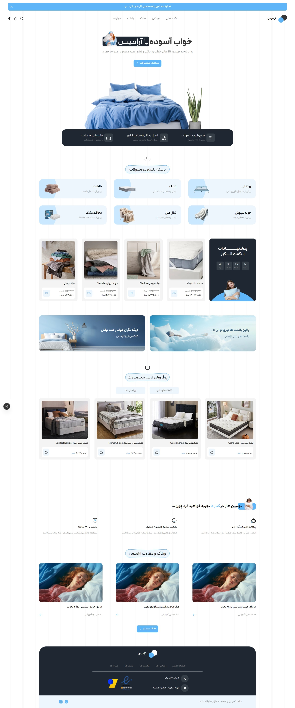

# Aramis Sleep Store

A full-stack e-commerce web application for selling sleep comfort products such as beds, mattresses, and bedding accessories.

<div align="center">
  
</div>

## About The Project

Aramis Sleep Store is a full-stack e-commerce platform built with Next.js, providing a complete shopping experience with a modern UI and dynamic backend integration.

The system includes authentication, product management, filtering, cart functionality, comments, and fully dynamic data handling using APIs and MongoDB.

## Features

- User Authentication (Login / Register)
- Product Listing and Product Details Page
- Product Categories and Filtering System
- Best Selling Products Section
- Shopping Cart Management
- Product Comments System
- Breadcrumb Navigation
- Pagination for Products
- Skeleton Loading for Product Fetching
- Loading States
- Error Handling (try/catch)
- Add to Cart Functionality
- Dynamic Data Handling via REST APIs
- Component-Based Architecture
- Fully Responsive Design

## Tech Stack

- Next.js (Full Stack Framework)
- MongoDB
- Tailwind CSS
- Formik
- Yup
- Swiper
- Toastify
- AOS (Animate on Scroll)

## UI / UX

- Modern and clean design
- Fully responsive across all devices
- Smooth animations using AOS
- Optimized user experience and navigation

## Backend

- Next.js API Routes
- MongoDB integration
- Authentication system (login/register)
- Scalable REST API structure
- Dynamic data management

## Pages

- Home Page
- Products Page
- Product Details Page
- Cart Page
- Authentication Pages

## Getting Started

```bash
git clone https://github.com/Melikapiri/sleepshop-nextjs
cd aramis-sleep-store
npm install
npm run dev